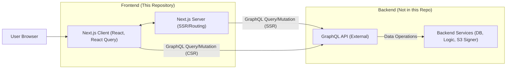

# System Architecture

This project implements the frontend layer of a Twitter-like application. It follows a client-server architecture where this Next.js application acts as the client, interacting with a remote GraphQL API for all data operations.



1.  **User Interaction:** The user interacts with the application through their web browser.
2.  **Next.js (Client-Side):** The React application runs in the user's browser. It handles UI rendering, manages client-side state (using `useState` and React Query), and makes GraphQL requests to the API for data fetching and mutations during user interactions (CSR - Client-Side Rendering).
3.  **Next.js (Server-Side):** The Next.js server handles initial page requests. For pages using `getServerSideProps` (`/` and `/[id].tsx`), it fetches necessary data from the GraphQL API *before* sending the pre-rendered HTML to the browser (SSR - Server-Side Rendering). It also handles routing.
4.  **GraphQL Client (`clients/api.ts`):** A `graphql-request` client instance configured to communicate with the `NEXT_PUBLIC_API_URL`. It automatically attaches the JWT authentication token from `localStorage` to outgoing requests if available.
5.  **GraphQL API (External):** A separate backend service (hosted at `https://d170eyh2z0r1e0.cloudfront.net/graphql`) that processes GraphQL queries and mutations, interacts with the database, handles authentication logic, and generates pre-signed URLs for image uploads.
6.  **Backend Services:** Includes the database, authentication logic, image storage interaction (like AWS S3), and other business logic required by the GraphQL API.

## Project Folder Structure

```
piyushgarg-dev-twitter-clone/
├── clients/              # API client configurations (GraphQL client)
│   └── api.ts            # GraphQL client setup
├── components/           # Reusable React components
│   └── FeedCard/         # Components related to displaying tweets
│       ├── index.tsx     # Individual tweet card component
│       └── Layout/       # Layout components
│           └── TwitterLayout.tsx # Main application layout (sidebar, feed area)
├── gql/                  # Auto-generated GraphQL types and operations (from graphql-codegen)
│   ├── fragment-masking.ts # Helper for GraphQL fragments (codegen preset)
│   ├── gql.ts            # Typed document node function (codegen preset)
│   ├── graphql.ts        # Generated TypeScript types for GraphQL schema/operations
│   └── index.ts          # Barrel file for exporting generated code
├── graphql/              # GraphQL query and mutation definitions
│   ├── mutation/         # Mutation documents
│   │   ├── tweet.ts      # Tweet-related mutations (create)
│   │   └── user.ts       # User-related mutations (follow/unfollow)
│   └── query/            # Query documents
│       ├── tweet.ts      # Tweet-related queries (getAll, getSignedURL)
│       └── user.ts       # User-related queries (getCurrent, getById, verifyToken)
├── hooks/                # Custom React hooks for data fetching and mutations
│   ├── tweet.ts          # Hooks for tweet operations (useCreateTweet, useGetAllTweets)
│   └── user.ts           # Hook for user operations (useCurrentUser)
├── pages/                # Next.js pages (routes)
│   ├── [id].tsx          # Dynamic route for user profiles
│   ├── _app.tsx          # Custom App component (global providers, layout)
│   ├── _document.tsx     # Custom Document component (HTML structure)
│   ├── index.tsx         # Home page (main tweet feed)
│   └── api/              # Next.js API routes (only default hello.ts present)
│       └── hello.ts
├── public/               # Static assets
├── styles/               # Global styles
│   └── globals.css       # Tailwind directives, global CSS
├── .eslintrc.json        # ESLint configuration
├── .gitignore            # Git ignore rules
├── codegen.ts            # GraphQL Code Generator configuration
├── graphql.schema.json   # Introspection result of the GraphQL API schema
├── next.config.js        # Next.js configuration (image domains, etc.)
├── package.json          # Project dependencies and scripts
├── postcss.config.js     # PostCSS configuration (for Tailwind)
├── tailwind.config.js    # Tailwind CSS configuration
└── tsconfig.json         # TypeScript configuration
```

## Major Components

*   **`TwitterLayout` (`components/FeedCard/Layout/TwitterLayout.tsx`):** The main shell of the application. It renders the persistent sidebar navigation, the central content area (where page content is rendered via `props.children`), and the right sidebar (containing Google Login/Recommended Users). It also fetches current user data (`useCurrentUser`) to display user info and manage login state.
*   **`FeedCard` (`components/FeedCard/index.tsx`):** A reusable component responsible for rendering a single tweet, including the author's information, content, optional image, and action buttons (like, retweet, etc. - currently placeholders).
*   **`pages/index.tsx`:** The home page. It renders the tweet composition area (including image selection logic) and the main tweet feed by mapping over data fetched via `useGetAllTweets`. It uses `getServerSideProps` for the initial tweet fetch.
*   **`pages/[id].tsx`:** The user profile page. It uses `getServerSideProps` to fetch the profile user's data based on the route parameter (`id`). It displays user information, follow/unfollow buttons (conditionally rendered), and the user's own tweets using `FeedCard`.
*   **Custom Hooks (`hooks/`):** Encapsulate the logic for interacting with the GraphQL API via React Query.
    *   `useCurrentUser`: Fetches and provides data for the logged-in user.
    *   `useGetAllTweets`: Fetches and provides the list of all tweets.
    *   `useCreateTweet`: Provides a function (`mutateAsync`) to create a new tweet and handles cache invalidation.
    *   *(Implicitly, mutations for follow/unfollow are called directly via `graphqlClient.request` within the profile page component, but could be extracted into hooks).*
*   **GraphQL Client (`clients/api.ts`):** A centralized instance of `graphql-request` used by all hooks and direct API calls. Handles setting the Authorization header.

## Data Flow

### Fetching Data (e.g., Tweets)

1.  **Component Mount/Render:** `pages/index.tsx` renders.
2.  **Hook Execution:** `useGetAllTweets` hook is called.
3.  **React Query:** Checks if valid cached data for `all-tweets` exists.
    *   **Cache Hit:** Returns cached data immediately. May trigger background refetch if stale.
    *   **Cache Miss:** Proceeds to fetch.
4.  **API Call:** The `queryFn` inside `useGetAllTweets` calls `graphqlClient.request(getAllTweetsQuery)`.
5.  **GraphQL Client:** Sends the `getAllTweets` query to the GraphQL API endpoint, including the Auth token if present.
6.  **API Response:** GraphQL API returns the list of tweets.
7.  **React Query:** Caches the fetched data under the `all-tweets` key and returns it to the hook.
8.  **Component Update:** `pages/index.tsx` receives the `tweets` data and re-renders to display them using `FeedCard` components.

### Creating a Tweet (Mutation)

1.  **User Input:** User types content in the `textarea` and optionally selects an image on `pages/index.tsx`.
2.  **(Image Upload):** If an image is selected:
    *   `handleSelectImage` -> `handleInputChangeFile` triggers.
    *   `getSignedURLForTweetQuery` is sent via `graphqlClient`.
    *   API returns a pre-signed URL.
    *   Frontend uploads image directly to the URL using `axios.put`.
    *   The final image URL is stored in component state (`imageURL`).
3.  **User Action:** User clicks the "Tweet" button.
4.  **Hook Execution:** `handleCreateTweet` calls `mutateAsync` from the `useCreateTweet` hook, passing the `content` and `imageURL`.
5.  **React Query Mutation:**
    *   `onMutate` callback runs (shows loading toast).
    *   The `mutationFn` calls `graphqlClient.request(createTweetMutation, { payload })`.
6.  **GraphQL Client:** Sends the `createTweet` mutation with payload to the API.
7.  **API Response:** GraphQL API creates the tweet, stores it, and returns the new tweet's ID (or other requested fields).
8.  **React Query Mutation:**
    *   `onSuccess` callback runs.
    *   `queryClient.invalidateQueries(["all-tweets"])` marks the tweet feed data as stale. React Query will automatically refetch it.
    *   Success toast is shown.
9.  **Component Update:** Input fields are cleared. The tweet feed refetches and displays the new tweet.

### Authentication Flow

1.  User clicks Google Login button (`TwitterLayout`).
2.  `@react-oauth/google` handles the popup/redirect and returns a `CredentialResponse`.
3.  `handleLoginWithGoogle` callback receives the `googleToken`.
4.  `graphqlClient.request(verifyUserGoogleTokenQuery, { token: googleToken })` is called.
5.  API verifies the token, finds/creates a user, generates a JWT.
6.  API returns the JWT string.
7.  Frontend stores the JWT in `localStorage.setItem("__twitter_token", verifyGoogleToken)`.
8.  `queryClient.invalidateQueries(["curent-user"])` triggers a refetch of the current user data using the new token (which will now be included in headers by `clients/api.ts`).
9.  Relevant UI components update based on the new user state.

## Design Decisions

*   **Next.js:** Chosen for its hybrid rendering capabilities (SSR for initial load speed/SEO on key pages, CSR for dynamic interactions), file-based routing, and overall streamlined React development experience.
*   **GraphQL:** Selected for efficient data fetching, strong typing, and flexibility in evolving the API without breaking clients. Enables fetching complex, nested data in single requests (e.g., user with their tweets, followers, following).
*   **React Query:** Adopted to handle the complexities of server state management (caching, background updates, mutations) declaratively, reducing boilerplate compared to manual state management with `useState`/`useEffect`.
*   **GraphQL Code Generator:** Used to automatically generate TypeScript types from the GraphQL schema and operations. This ensures end-to-end type safety, catching potential errors at build time and improving developer productivity.
*   **Tailwind CSS:** Utilized for rapid UI development using utility classes directly in the markup, promoting consistency and maintainability without writing extensive custom CSS.
*   **Custom Hooks:** Data fetching and mutation logic are encapsulated within custom hooks (`useCurrentUser`, `useCreateTweet`, etc.) to promote reusability and separation of concerns. Components focus on rendering UI based on the data provided by hooks.
*   **Direct S3 Upload (via Signed URLs):** Offloads the bandwidth and processing burden of file uploads from the backend API server directly to cloud storage (S3), which is a scalable pattern.
*   **JWT for Authentication:** Standard practice for session management in SPAs and APIs. Storing it in localStorage is common, though susceptible to XSS (HttpOnly cookies managed by the backend would be more secure, but harder to implement purely client-side with an external API).